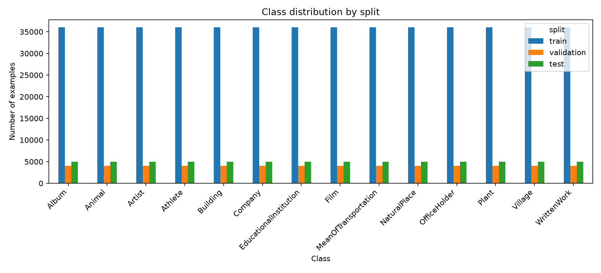
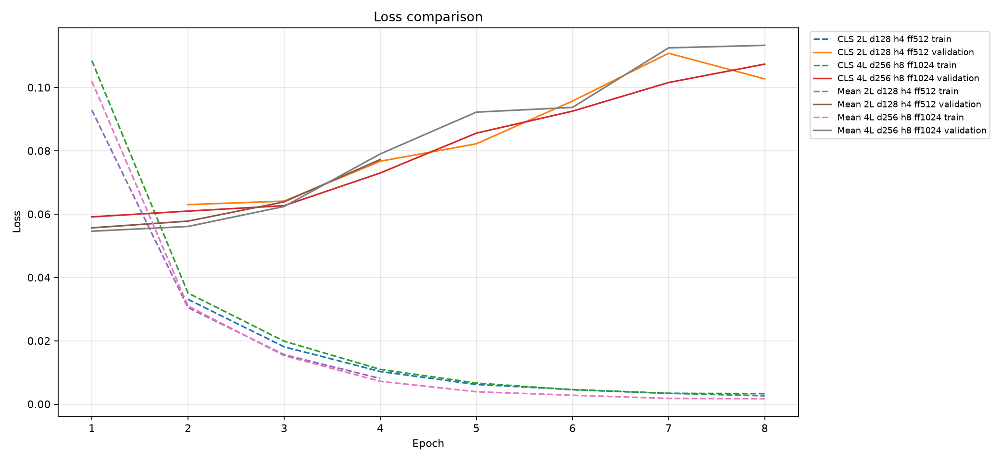
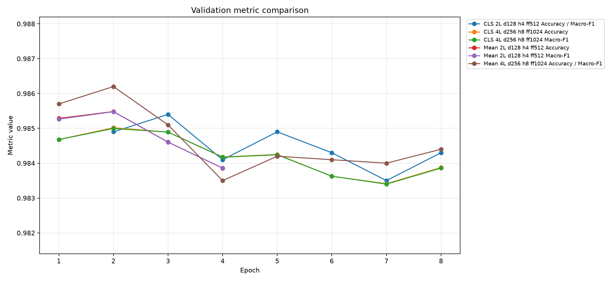
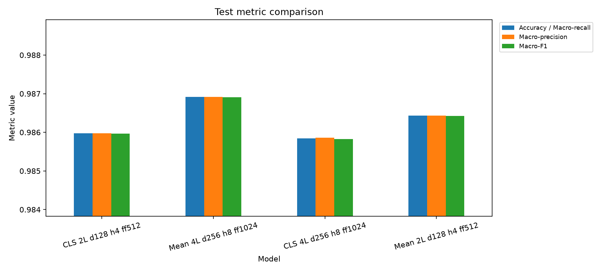
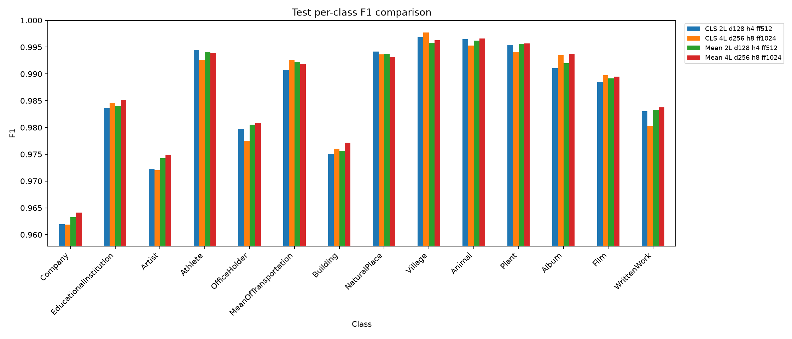

# Klasifikacija DBpedia članaka pomoću encoder-only Transformer modela

## Opis problema

Cilj projekta je klasifikacija DBpedia članaka u jednu od 14 ontoloških kategorija. Svaki primer sadrži naslov, tekstualni opis i celobrojnu oznaku klase. Model dobija jedan tekstualni ulaz nastao spajanjem naslova i opisa, a na izlazu daje 14 logita, po jedan za svaku klasu.

Zadatak spada u nadgledanu višeklasnu klasifikaciju teksta. Za razliku od encoder-decoder Transformer modela za prevođenje, ovde se ne generiše nova sekvenca. Potrebno je izračunati reprezentaciju celog ulaza i preslikati je u fiksan skup klasa.

| ID | Klasa |
|---:|---|
| 0 | Company |
| 1 | EducationalInstitution |
| 2 | Artist |
| 3 | Athlete |
| 4 | OfficeHolder |
| 5 | MeanOfTransportation |
| 6 | Building |
| 7 | NaturalPlace |
| 8 | Village |
| 9 | Animal |
| 10 | Plant |
| 11 | Album |
| 12 | Film |
| 13 | WrittenWork |

## Skup podataka

Korišćen je skup `fancyzhx/dbpedia_14`, lokalno sačuvan u fajlovima `data/train.parquet` i `data/test.parquet`. Svaki red ima kolone `label`, `title` i `content`.

Zvanični trening skup ima 560.000 primera, a test skup 70.000 primera. Skup je balansiran: svaka klasa ima 40.000 trening primera i 5.000 test primera. Za validaciju se iz trening skupa izdvaja 10% (konfigurabilno) primera, stratifikovano po klasama.

| Split | Broj primera | Broj primera po klasi |
|---|-------------:|----------------------:|
| Trening |      504.000 |                36.000 |
| Validacija |       56.000 |                 4.000 |
| Test |       70.000 |                 5.000 |



Trening, validacija i test imaju različite uloge. Trening podaci se koriste za ažuriranje težina modela. Validacioni skup se ne koristi za učenje težina, već za proveru generalizacije posle svake epohe i izbor najboljeg checkpoint-a. Test skup ostaje odvojen do kraja i služi za finalnu procenu modela. Ovakva podela sprečava da se arhitektura i hiperparametri prilagode direktno test skupu, što bi dalo previše optimističan rezultat.

Pošto se validacija uzima iz zvaničnog trening skupa, broj trening primera po klasi se smanjuje sa 40.000 na 36.000. Validacija dobija preostalih 4.000 primera po klasi. Stratifikovana podela čuva balans klasa, pa validacione i test metrike bolje pokazuju ponašanje modela kroz sve kategorije, a ne samo kroz najčešće klase.

Ulaz u model formira se ovako:

```text
title: <naslov>
content: <sadržaj>
```

Ovaj format čuva razliku između naslova i sadržaja, iako Transformer obrađuje jednu sekvencu tokena. Tokeni `title:` i `content:` daju modelu korisnu strukturnu informaciju.

## Arhitektura

Rešenje koristi mali encoder-only Transformer klasifikator implementiran u PyTorch-u. Encoder-only arhitektura je prirodan izbor za ovaj zadatak zato što se ne generiše tekst, već se ceo ulaz  preslikava u jednu od unapred poznatih klasa. Decoder deo, koji je koristan kod zadataka kao što su prevođenje ili generisanje odgovora token po token, ovde bi samo povećao složenost bez direktne koristi.

```text
title + content
-> byte-level BPE tokenizer
-> token ID-jevi
-> token embeddings
-> sinusoidal positional encoding
-> Transformer encoder
-> pooling
-> linearna klasifikaciona glava
-> 14 logita
```

Prvi deo arhitekture je priprema teksta. Naslov i sadržaj se spajaju u jedan ulaz u formatu `title: ...` i `content: ...`, jer model prima jednu sekvencu tokena. Oznake `title:` i `content:` ostaju u tekstu kao jednostavan način da model razlikuje kratak, informativan naslov od dužeg opisa. Tokenizer je byte-level BPE tokenizer sa veličinom rečnika `vocab_size = 30000` i minimalnom frekvencijom tokena `min_token_frequency = 2`. Ovakva tokenizacija je izabrana zato što DBpedia sadrži mnogo vlastitih imena, retkih reči, skraćenica, brojeva i simbola. Byte-level BPE ne zavisi samo od unapred poznatih celih reči, već može da razloži nepoznat tekst na manje podjedinice, pa model dobija stabilan ulaz i za retke pojmove.

Tokenizer dodaje specijalne tokene `[CLS]` i `[SEP]`. Token `[CLS]` stoji na početku sekvence i koristi se kod `cls` pooling varijante kao zajednička reprezentacija celog teksta. Token `[SEP]` označava kraj korisnog teksta. Sekvence se zatim skraćuju ili dopunjavaju do `text_context_size = 192`. Skraćivanje ograničava memoriju i vreme treninga, jer cena self-attention mehanizma raste približno kvadratno sa dužinom sekvence. Dopunjavanje padding tokenima omogućava da svi primeri u istoj mini-grupi imaju isti oblik tenzora. Uz padding se pravi `attention_mask`, tako da model zna koji tokeni su stvaran tekst, a koji su samo dopuna.

Embedding sloj mapira svaki token ID u gust vektor dimenzije `model_dimension`. To je prva naučiva reprezentacija teksta: tokom treninga model uči da tokeni koji su korisni za slične klase dobiju vektore pogodne za kasnije slojeve. Embedding se množi sa `sqrt(model_dimension)`, što je standardna Transformer praksa koja održava razmeru embedding vrednosti usklađenom sa pozicionim kodiranjem i stabilizuje početak treninga.

Pošto self-attention sam po sebi ne zna redosled tokena, embedding vektorima se dodaje sinusoidal positional encoding. Poziciono kodiranje daje modelu informaciju da se token nalazi na početku, sredini ili kraju teksta, što je bitno jer naslov i prve rečenice često nose najviše informacije o kategoriji. Korišćeno je fiksno sinusoidal kodiranje, a ne naučivo poziciono kodiranje, zato što je jednostavno, nema dodatne parametre i dovoljno je za fiksnu maksimalnu dužinu od 192 tokena.

Glavni deo modela je stek Transformer encoder blokova. Svaki blok ima multi-head self-attention, feed-forward mrežu, rezidualne veze, dropout i layer normalization. Multi-head self-attention omogućava da svaki token koristi informacije iz svih drugih nepadding tokena. Više glava pažnje daje modelu mogućnost da paralelno prati različite odnose u tekstu, na primer ime osobe, profesiju, instituciju, lokaciju ili tip umetničkog dela. To je važno kod klasa koje dele sličan vokabular, kao što su `Album` i `Film`, `Company` i `Building`, ili `Athlete` i `OfficeHolder`.

Padding tokeni se isključuju iz pažnje pomoću `key_padding_mask`. Bez toga bi model mogao da obraća pažnju na veštački dodate `[PAD]` tokene, što bi kvarilo reprezentaciju, naročito kod kraćih tekstova. Implementacija koristi PyTorch `nn.MultiheadAttention` sa `batch_first=True`, pa tenzori imaju oblik `[batch_size, sequence_length, model_dimension]`. To odgovara načinu na koji DataLoader formira batch i čini tok podataka čitljivijim.

Feed-forward mreža posle pažnje obrađuje svaki token zasebno. Ona ima projekciju iz `model_dimension` u `feed_forward_dimension`, GELU aktivaciju, dropout i projekciju nazad u `model_dimension`. Self-attention meša informacije između tokena, a feed-forward deo zatim nelinearno transformiše reprezentaciju svakog tokena. Veća `feed_forward_dimension` povećava kapacitet modela, ali povećava i broj parametara, vreme treninga i rizik od preprilagođavanja.

Rezidualne veze dodaju izlaz attention ili feed-forward dela nazad na njegov ulaz. Time se čuva prethodna reprezentacija i olakšava protok gradijenata kroz više slojeva. Layer normalization se koristi pre attention i pre feed-forward dela, što je takozvani pre-norm raspored. Pre-norm je stabilan za trening Transformera jer normalizuje ulaz u svaki podsloj pre nego što se izračuna nova transformacija. Dropout se koristi posle attention i feed-forward izlaza i u klasifikacionoj glavi, kako model ne bi previše zavisio od pojedinačnih aktivacija.

Nakon poslednjeg encoder sloja dobija se reprezentacija za svaki token. Pošto klasifikacija zahteva jedan vektor po primeru, koristi se pooling. U `cls` varijanti uzima se reprezentacija prvog tokena, odnosno `[CLS]`. Ideja je da taj token tokom treninga nauči da skuplja informaciju iz cele sekvence. U `mean` varijanti računa se prosek svih tokena koji nisu padding. Mean pooling je jednostavniji i često stabilniji za manje modele jer koristi signal iz cele sekvence direktno, umesto da sav teret sažimanja padne na jedan token.

Klasifikaciona glava je namerno jednostavna: dropout pa jedan linearni sloj iz `model_dimension` u `num_classes = 14`. Izlaz su logiti, a ne verovatnoće. To je važno jer `CrossEntropyLoss` u PyTorch-u očekuje sirove logite i interno računa log-softmax. Tokom inference se za prikaz pouzdanosti dodatno primenjuje `softmax`, ali tokom treninga softmax nije potreban kao poseban sloj.

Model se gradi kroz funkciju `build_classifier`, koja proverava da je `model_dimension` deljiv sa `num_heads`. Ta provera je neophodna jer se embedding dimenzija deli na jednake attention glave. Težine matrica sa više od jedne dimenzije inicijalizuju se Xavier uniform inicijalizacijom, što daje razumnu početnu skalu za linearne projekcije i pomaže da trening počne stabilno.

## Parametri modela i treninga

Evidentirana su četiri modela.

| Parametar | CLS 2L d128 h4 ff512 | Mean 2L d128 h4 ff512 | Mean 4L d256 h8 ff1024 | CLS 4L d256 h8 ff1024 |
|---|---:|---:|---:|---:|
| `model_dimension` | 128 | 128 | 256 | 256 |
| `num_layers` | 2 | 2 | 4 | 4 |
| `num_heads` | 4 | 4 | 8 | 8 |
| `feed_forward_dimension` | 512 | 512 | 1024 | 1024 |
| `pooling` | cls | mean | mean | cls |
| `learning_rate` | 0.0005 | 0.0005 | 0.0003 | 0.0003 |
| `text_context_size` | 192 | 192 | 192 | 192 |
| `vocab_size` | 30000 | 30000 | 30000 | 30000 |
| `dropout` | 0.1 | 0.1 | 0.1 | 0.1 |
| `batch_size` | 64 | 64 | 64 | 64 |
| `num_epochs` | 8 | 4 | 8 | 8 |
| `weight_decay` | 0.01 | 0.01 | 0.01 | 0.01 |
| `max_grad_norm` | 1.0 | 1.0 | 1.0 | 1.0 |
| `validation_fraction` | 0.1 | 0.1 | 0.1 | 0.1 |
| `seed` | 561 | 561 | 561 | 561 |
| Optimizator | AdamW | AdamW | AdamW | AdamW |
| Funkcija greške | CrossEntropyLoss | CrossEntropyLoss | CrossEntropyLoss | CrossEntropyLoss |
| Uređaj | mps | mps | mps | mps |

Zajednički parametri imaju sledeću ulogu:

- `dropout = 0.1` smanjuje preprilagođavanje tako što tokom treninga nasumično isključuje deo aktivacija.
- `weight_decay = 0.01` uvodi L2 regularizaciju kroz AdamW i sprečava prevelike težine.
- `max_grad_norm = 1.0` ograničava normu gradijenata i stabilizuje trening.
- `batch_size = 64` predstavlja kompromis između stabilnosti gradijenta, brzine i memorije.
- `CrossEntropyLoss` je standardna funkcija greške za višeklasnu klasifikaciju sa logitima.
- `AdamW` je optimizator sa odvojenim weight decay korakom, što je pogodnije za Transformer modele od klasičnog Adam optimizatora sa L2 kaznom.
- `seed = 561` obezbeđuje ponovljiv split podataka i determinističnije poređenje modela.
- MPS backend je dostupan i korišćen za ubrzanje treninga na Apple Silicon uređaju.

Manji modeli imaju 2 encoder sloja, dimenziju 128 i 4 attention glave. Veći modeli imaju 4 sloja, dimenziju 256, 8 glava i feed-forward dimenziju 1024. Time se odvojeno proveravaju uticaj kapaciteta i pooling strategije. Kod `cls` pooling-a klasifikacija se oslanja na reprezentaciju `[CLS]` tokena, dok `mean` pooling koristi prosek svih nepraznih tokena.

## Validacija

| Model | Najbolja epoha | Najbolji validacioni loss | Najbolja validaciona tačnost | Poslednja validaciona tačnost |
|---|---------------:|---:|-----------------------------:|------------------------------:|
| CLS 4L d256 h8 ff1024 |              2 | 0.0609 |                       0.9850 |                        0.9839 |
| CLS 2L d128 h4 ff512 |              3 | 0.0641 |                       0.9854 |                        0.9843 |
| Mean 2L d128 h4 ff512 |              2 | 0.0557 |                       0.9855 |                        0.9838 |
| Mean 4L d256 h8 ff1024 |              2 | 0.0561 |                       0.9862 |                        0.9844 |

Kod kompletiranih osmoepoških treninga najbolja validacija dolazi rano, a zatim trening loss nastavlja da opada dok validacioni loss raste. To je jasan znak preprilagođavanja. Osam epoha je dovoljno da modeli nauče osnovne obrasce, ali za ove konfiguracije bi praktičniji izbor bio early stopping oko 2. ili 3. epohe.

Veći mean pooling model ima najbolju validacionu tačnost. Veći CLS model nema isti dobitak, iako ima isti kapacitet kao mean model. To pokazuje da dodatni slojevi i veća dimenzija nisu dovoljni sami po sebi: pooling strategija utiče na to koliko dobro se reprezentacija teksta koristi za klasifikaciju. Mean pooling je ovde stabilniji jer koristi sve tokene koji nisu padding, dok `[CLS]` token mora sam da nauči da sažme ceo članak.





## Test rezultati

Test je rađen na punom test skupu od 70000 primera za tri modela.

| Model                  | Test primera | Tačnost | Macro-precision | Macro-recall | Macro-F1 |
|------------------------|-------------:|--------:|---:|---:|---:|
| CLS 4L d256 h8 ff1024  |       70.000 |  0.9858 | 0.9859 | 0.9858 | 0.9858 |
| CLS 2L d128 h4 ff512   |       70.000 |  0.9860 | 0.9860 | 0.9860 | 0.9860 |
| Mean 2L d128 h4 ff512  |       70.000 |  0.9864 | 0.9864 | 0.9864 | 0.9864 |
| Mean 4L d256 h8 ff1024 |       70.000 |  0.9869 | 0.9869 | 0.9869 | 0.9869 |

Najbolji test rezultat ima `Mean Pooling, 4L, d_model=256, 8H, d_ff=1024`. U odnosu na manji Mean baseline, veći Mean model poboljšava tačnost sa 0.9864 na 0.9869. Razlika nije velika, ali je konzistentna sa validacijom i pokazuje da veći kapacitet pomaže kada je pooling strategija dobra.

Veći CLS model je slabiji od mean modela i malo slabiji od manjeg CLS baseline-a. Najverovatnije objašnjenje je preprilagođavanje: veći model ima više parametara, a validacioni loss mu raste posle 2. epohe. Manji model ima manje kapaciteta i viši learning rate, ali zbog jednostavnije arhitekture ostaje konkurentan.

Pošto je skup podataka balansiran, accuracy, macro-recall i macro-F1 su veoma bliski. To znači da visoka tačnost nije posledica favorizovanja nekoliko najčešćih klasa, već da model dobro radi kroz skoro sve klase.





Najniže F1 klase su stabilne kroz modele:

| Model                  | Pet najnižih F1 klasa                                                                   |
|------------------------|-----------------------------------------------------------------------------------------|
| CLS 4L d256 h8 ff1024  | Company 0.9618, Artist 0.9720, Building 0.9760, OfficeHolder 0.9775, WrittenWork 0.9803 |
| CLS 2L d128 h4 ff512   | Company 0.9620, Artist 0.9723, Building 0.9751, OfficeHolder 0.9798, WrittenWork 0.9830 |
| Mean 2L d128 h4 ff512  | Company 0.9633, Artist 0.9742, Building 0.9756, OfficeHolder 0.9806, WrittenWork 0.9833 |
| Mean 4L d256 h8 ff1024 | Company 0.9641, Artist 0.9749, Building 0.9771, OfficeHolder 0.9809, WrittenWork 0.9837 |

`Company`, `Artist` i `Building` su najteže klase. To je očekivano jer imaju veće semantičko preklapanje sa drugim kategorijama. Kompanije i obrazovne institucije često dele administrativni rečnik, umetnici, sportisti i političari imaju slične biografske obrasce, a zgrade i prirodna mesta dele opise lokacije.

## Izlazni fajlovi

Glavni izvor za rezultate treninga je `reports/model_runs.json`. U njemu se čuvaju konfiguracije, istorija epoha, najbolja validaciona epoha i test metrike. Sačuvane predikcije za test skup nalaze se u:

```text
runs/test_cls_d128_l2_h4_ff512.parquet
runs/test_cls_d256_l4_h8_ff1024.parquet
runs/test_mean_d128_l2_h4_ff512.parquet
runs/test_mean_d256_l4_h8_ff1024.parquet
```

Skripta `scripts/generate_report_assets.py` iz tih podataka generiše tabele i grafike:

```text
reports/dataset_distribution.csv
reports/loss_curve.csv
reports/loss_curve.png
reports/loss_curve_<model_slug>.csv
reports/loss_curve_<model_slug>.png
reports/validation_metrics_curve.csv
reports/validation_metrics_curve.png
reports/validation_metrics_curve_<model_slug>.csv
reports/validation_metrics_curve_<model_slug>.png
reports/test_metrics.csv
reports/test_metrics.png
reports/test_metrics_<model_slug>.csv
reports/test_metrics_<model_slug>.png
reports/test_per_class_f1.csv
reports/test_per_class_f1.png
reports/test_per_class_f1_<model_slug>.csv
reports/test_per_class_f1_<model_slug>.png
reports/dataset_distribution.png
```

Nakon svake završene epohe `train.py` ažurira `reports/model_runs.json` i osvežava grafike, osim ako se prosledi `--no-report-refresh`. Nakon pune inference nad labeliranim test skupom `infer.py` ažurira test metrike i grafike. Ručno osvežavanje se pokreće komandom:

```bash
./.venv/bin/python scripts/generate_report_assets.py
```

Checkpoint fajlovi koriste naziv izveden iz arhitekture modela:

```text
checkpoints/best_mean_d128_l2_h4_ff512.pt
checkpoints/latest_mean_d128_l2_h4_ff512.pt
checkpoints/best_mean_d256_l4_h8_ff1024.pt
checkpoints/latest_mean_d256_l4_h8_ff1024.pt
checkpoints/best_cls_d256_l4_h8_ff1024.pt
checkpoints/latest_cls_d256_l4_h8_ff1024.pt
```

Fajlovi sa ekstenzijom `.pt` su PyTorch checkpoint fajlovi. U njima se čuvaju naučene težine modela, stanje optimizatora, broj epohe, globalni korak, validacione metrike, najbolji validacioni rezultat, konfiguracija modela, veličina rečnika, ID padding tokena i putanja do tokenizer-a. Zbog toga se mogu koristiti za nastavak treninga ili direktno učitavanje obučenog klasifikatora, pod uslovom da postoji odgovarajući tokenizer fajl `tokenizers/dbpedia_text_tokenizer.json`.

## Zaključak

Najbolji model je `Mean Pooling, 4L, d_model=256, 8H, d_ff=1024`, sa tačnošću 0.9869 i macro-F1 vrednošću 0.9869 na punom test skupu. Rezultat pokazuje da encoder-only Transformer dobro odgovara zadatku klasifikacije DBpedia članaka.

Najvažniji zaključak iz poređenja je da veći kapacitet pomaže samo ako je način agregacije tokena dobar. Mean pooling se pokazao boljim od `[CLS]` pooling-a za ovaj skup podataka, jer koristi informacije iz celog teksta. Kod svih modela se vidi preprilagođavanje posle ranih epoha, pa bi sledeći korak bio uvođenje early stopping-a i dodatno podešavanje regularizacije.

## Reference

Dataset: `fancyzhx/dbpedia_14`, DBpedia 14-class text classification dataset.
